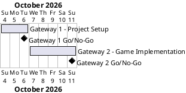

# Project Plan

## Metadata
| Key | Value |
| --- | --- |
| ID | PP-001 |
| CrossReference | [BC-001], [SA-001], [MIL-001], [MIL-002] |

## Version History
| Date | Status | Author | Reviewer | Change | Commit |
| --- | --- | --- | --- | --- | --- |
| 2026-10-04 | Accepted | Jens Tirsvad Nielsen | S01 | Initial version | pending |

---

## Purpose

Schedule the two gateways that deliver the Blackjack game within the Business Case's two-evening effort constraint ([BC-001]).

## Planning Assumptions

- Week 1 starts 2026-10-04; the plan ends by 2026-10-11.
- Phase length: setup 2 days, implementation 5 days (part-time).
- Communication follows [SA-001]: one pull request review by S01 per gateway; S02 and S03 are served by the published repository.
- PO language is English; no translated copies are kept.

## Gateway Schedule

| Gateway | Document | Window | Decision date | Owner | Stories | Main deliverable | Milestone |
| --- | --- | --- | --- | --- | --- | --- | --- |
| Gateway 1 - Project Setup | [MIL-001] | 2026-10-04 to 2026-10-06 | 2026-10-06 | S01 | none | Layout, pyproject, constants, Doxyfile, README | [Milestone-34] |
| Gateway 2 - Game Implementation | [MIL-002] | 2026-10-07 to 2026-10-11 | 2026-10-11 | S01 | none | Playable, tested, documented game | [Milestone-35] |



## Scope Coverage

| Business Case scope item | Gateway |
| --- | --- |
| Project scaffolding and README | [MIL-001] |
| Git host description and topics | [MIL-001] |
| Game logic, emoji cards, logo, restart | [MIL-002] |
| Unit tests | [MIL-002] (smoke test in [MIL-001]) |
| Doxygen documentation | [MIL-001] (Doxyfile), [MIL-002] (comments) |

## Dependencies

```
Gateway 1 - Project Setup -> Gateway 2 - Game Implementation
```

A No-Go on Gateway 1 moves every Gateway 2 date by the same number of days.

## Plan Risks

| Risk | Impact | Mitigation |
| --- | --- | --- |
| Part-time availability | Dates slip | Dates are targets; a slip is recorded here, scope is not cut |
| Git host API token lacks permission to edit repository metadata | Task 1 of Gateway 1 blocked | Set description and topics by hand in the web UI |

## Open Issues

- No use cases or user stories are modelled: all tasks are plain technical tasks because the assignment is a small single-actor console program. Say if a use case (for example "Play a game of Blackjack") should be added first.
- The reviewer for every artifact is S01 (sole stakeholder); an independent reviewer would need a new stakeholder ID.
- No README template was supplied, so a standard layout is used.
- The Python `.gitignore` already exists in the repository and is verified in [MIL-001] task 2.

---

[BC-001]: ./business-case.md
[SA-001]: ./stakeholder-analysis.md
[MIL-001]: ./milestones/mil-001-project-setup.md
[MIL-002]: ./milestones/mil-002-game-implementation.md
[Milestone-34]: https://git.tirsystem.com/Tirsvad-Udemy-100_days_of_code/011-black-jack/milestone/34
[Milestone-35]: https://git.tirsystem.com/Tirsvad-Udemy-100_days_of_code/011-black-jack/milestone/35
